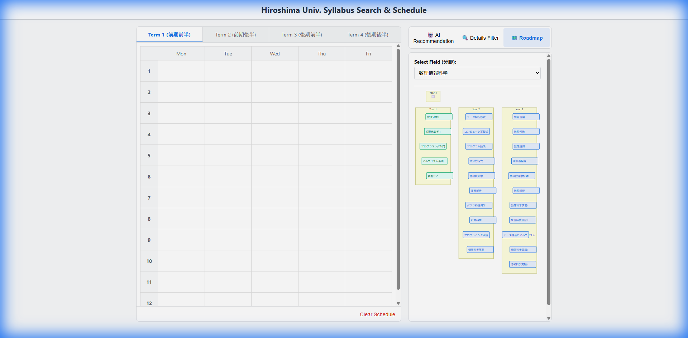
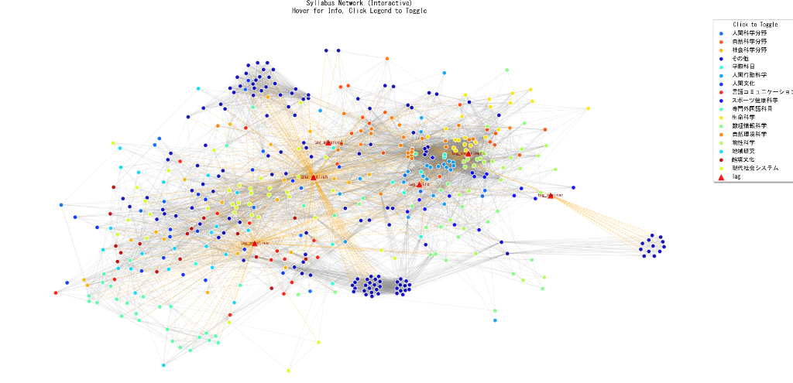
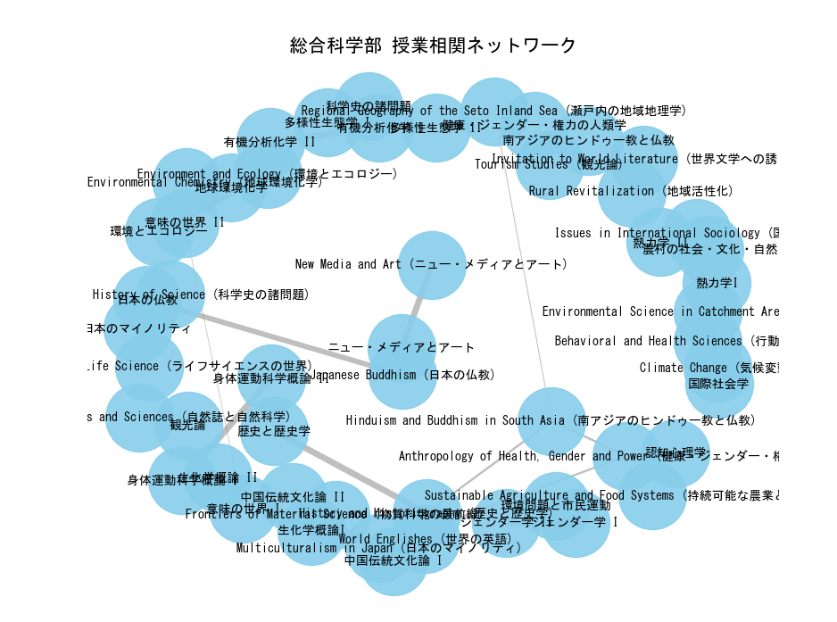

# Hiroshima University Syllabus Analysis

This project is organized into versions to manage different stages of development.

## 📂 Directory Structure

### `v3/` (Experimental)
Focuses on curriculum visualization and roadmap generation.
- **Roadmap**: Visualizes course connections and "Year 1" paths using Mermaid.js.
- **Web Demo**: `v3/demo003.html` (Requires `v2` data).


### `v2/` (Stable & Recommended)
Contains the latest analysis logic, including 2D interactive graphs and improved skill tagging.
- **Run Analysis**: `cd v2; python preprocess002.py`
- **Visualize (2D Interactive)**: `cd v2; python NetworkX2D002.py`
- **Visualize (3D)**: `cd v2; python NetworkX3D002.py`
- **Web Demo**: `v2/demo002.html`


### `v1/` (Legacy)
Previous version of the analysis.
- **Run Analysis**: `cd v1; python preprocess001.py`
- **Visualize**: `cd v1; python NetworkX3D.py`
- **Web Demo**: `v1/demo001.html`


### `common_data/`
Shared source data files (JSON).
- `integrated_arts_courses.json`
- `subject_details_main...json`

### `common/`
Utility scripts and scrapers.
- `main.py`: Syllabus Scraper (outputs to `common_data/`)

## 🚀 How to Start
1. Navigate to the latest version:
   ```bash
   cd v2
   ```
2. Generate data (if needed):
   ```bash
   python preprocess002.py
   ```
3. Run visualization:
   ```bash
   python NetworkX2D002.py
   ```
