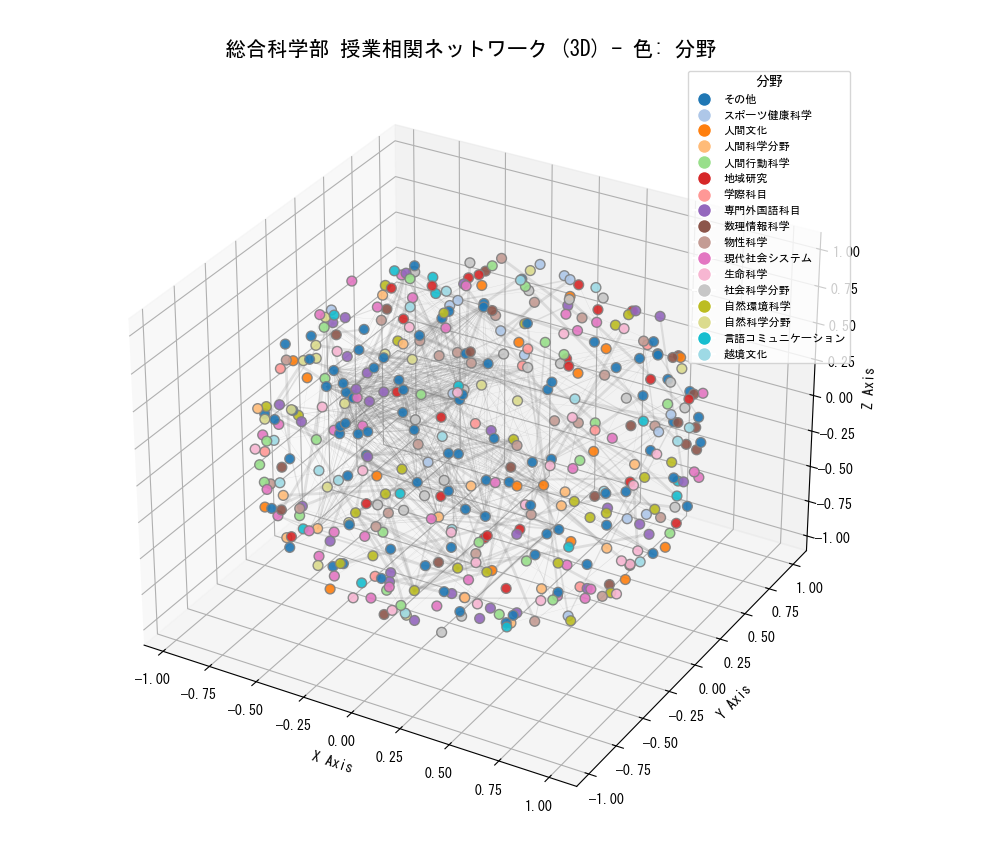

# Hiroshima University Syllabus Analysis & Synchronization
広島大学シラバス分析・可視化・検索システム

This project provides a comprehensive suite of tools for analyzing, visualizing, and searching Hiroshima University syllabus data. It includes 3D network visualizations, AI-powered recommendations, and manual categorization tools.

## 🌟 Key Features / 主な機能

### 1. 3D Network Visualization / 3D可視化
Visualize the relationships between courses in a 3D space based on syllabus content similarity.
- **Script**: `NetworkX3D.py`
- **Features**:
  - Color-coded by Academic Field (分野).
  - Interactive rotation and zooming.
  - Labels removed for clarity (clean visualization).



### 2. Integrated Arts & Sciences Categorization / 総合科学部の領域分類
A complete workflow to extract and categorize courses from the Faculty of Integrated Arts and Sciences.
- **Workflow**:
  1. **Extraction**: `extract_integrated_arts.py` & `merge_ias_courses.py` (filters and merges "Specialized Subjects").
  2. **Categorization**: `manual_categorize_gui.py` (GUI tool for manual tagging of Area/Field).
  3. **Data Source**: `integrated_arts_courses.json` (The master categorized dataset).

### 3. AI Recommendation Engine / AIレコメンデーション
A web-based search engine `demo001.html` that recommends courses based on:
- **Interest Keywords**: (e.g., "AI", "History")
- **Career Goals**: (e.g., "Data Scientist")
- **Academic Focus**: (STEM, Humanities, Social Sciences) - *Applies keyword boosting*.

## 📂 File Structure / ファイル構成

- **Visualization**
  - `NetworkX3D.py`: 3D scatter plot of course relationships.
  - `NetworkX.py`: 2D network graph generator.

- **Data Processing**
  - `preprocess001.py`: Generates TF-IDF vectors (`syllabus_vectors.json`) and metadata (`course_metadata.json`) for the web app.
  - `manual_categorize_gui.py`: Tkinter GUI for assigning `領域` (Area) and `分野` (Field) tags.
  - `merge_ias_courses.py`: Merges specialized subjects into the main IAS list.

- **Web Application**
  - `demo001.html`: Client-side search interface with AI recommendations.
  - `integrated_arts_courses.json`: The categorized dataset used by visualization scripts.

## 🚀 How to Run / 実行方法

### Dependencies
```bash
pip install networkx matplotlib scikit-learn janome
```

### 1. 3D Visualization
Run the script to see the network of 478 courses.
```bash
python NetworkX3D.py
```

### 2. Web Search App
Open `demo001.html` in your browser.
*(Note: Use a local server if CORS blocks access)*
```bash
python -m http.server
# Go to http://localhost:8000/demo001.html
```

### 3. Manual Categorization (GUI)
If you want to edit tags:
```bash
python manual_categorize_gui.py
```

---
*Project enhanced with Antigravity Assistant*